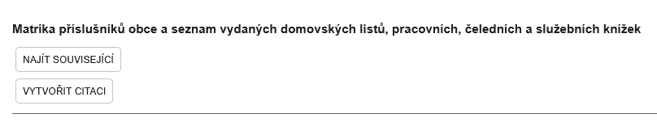
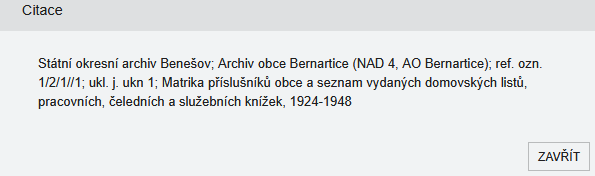

# Objednání archiválie do badatelny

## Jak objednat archiválie do badatelny

ARchiv ONline zatím neobsahuje funkci přímého objednání. Pro objednání jiným způsobem (datovou zprávou, e-mailem, písemně, osobně) kontaktujte, prosím, vždy příslušný organizační útvar archivu (centrálu v Praze nebo státní okresní archivy - kontakty na jednotlivá pracoviště najdete zde: https://www.soapraha.cz/kontakty/). Při objednání využívejte informace, které získáte u každé archiválie za pomocí tlačítka VYTVOŘIT CITACI.

--8<-- "abbr.md"
