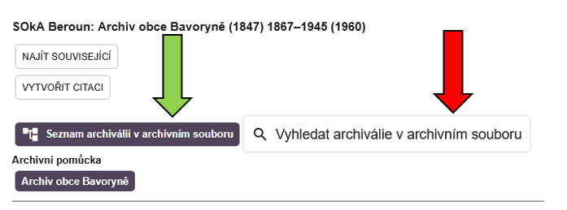
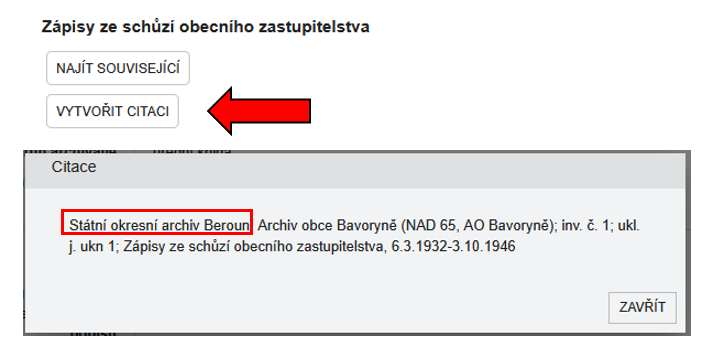
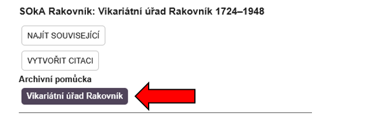
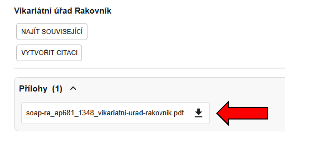
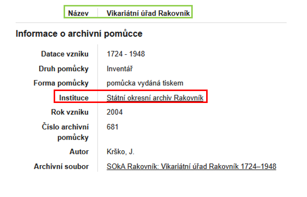

# Objednání archiválie do badatelny

Archiválie z dostupného archivního souboru je možné objednávat do badatelny dvojím způsobem, jelikož ARchiv ONline zatím neobsahuje funkci přímého objednání.

## Objednání archiválií z elektronické pomůcky 

Pomocí elektronické pomůcky lze vyhledávat pomocí klíčových slov (červená šipka), nebo procházet jednotlivé položky v hierarchické (stromové) struktuře (zelená šipka)

Požadovanou archiválii objednáte zasláním vygenerované citace VŽDY příslušnému organizačnímu útvaru archivu (centrálu v Praze nebo státní okresní archivy - kontakty na jednotlivá pracoviště najdete [^^zde^^](https://www.soapraha.cz/kontakty/)) formou datové zprávy, e-mailem či osobně.

## Jak vygenerovat citaci?

U každé archiválie zpřístupněné pomocí elektronické pomůcky je tlačítko VYTVOŘIT CITACI. Takto vygenerovanou citaci následně zkopírujete do e-mailu/datové zprávy a odešlete příslušnému archivu. Jeho název je první položkou citace.

## Objednání archiválií z neelektronické (naskenované) pomůcky

U archivního souboru zpřístupněného neelektronickou (naskenovanou) pomůckou je možné jednotlivé archiválie objednávat následujícím způsobem.

Kliknutím na samotnou pomůcku se tato pomůcka automaticky stáhne do vašeho počítače a otevře v novém okně

Pokud má archivní soubor dostupnou pomůcku pouze v naskenované formě, můžete při vaší e-mailové objednávce postupovat dvojím způsobem:

1. Označit požadované archiválie do stažené naskenované pomůcky a takovou následně zaslat jako přílohu e-mailu příslušnému okresnímu archivu nebo na centrálu na e-mail studovna@soapraha.cz (kontakty na jednotlivá pracoviště najdete [^^zde^^](https://www.soapraha.cz/kontakty/)).

2. Vytvořit ve stažené naskenované pomůcce výstřižky požadovaných archiválií a následně je zašlete spolu S NÁZVEM ARCHIVNÍHO FONDU (viz zelený obdélník) příslušnému archivu okresnímu archivu nebo na centrálu na e-mail studovna@soapraha.cz. 

--8<-- "abbr.md"
